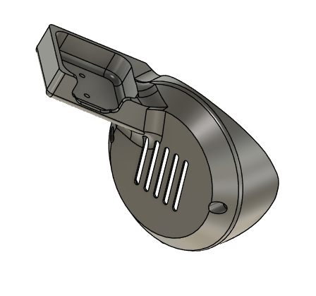
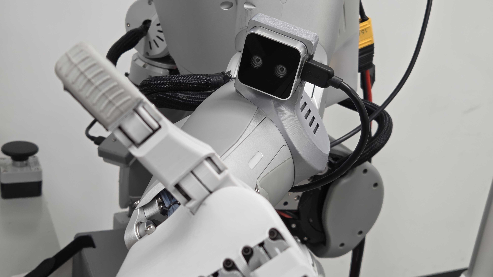
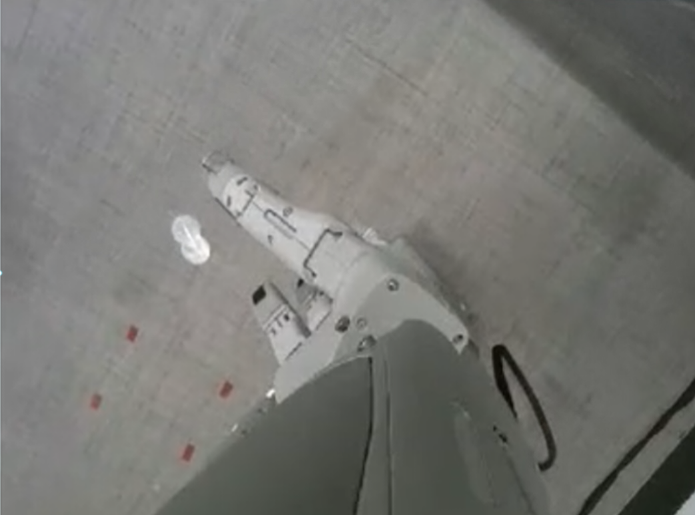

# IGRIS-C RealSense D405 Mount Bracket

A 3D-printable bracket for mounting an **Intel RealSense D405** on the forearm of the **IGRIS-C humanoid**.

The bracket is provided in **STL format** and can be converted to **G-code** for 3D printing.  
It is designed to be mounted on both the **thumb side** and the **pinky side** of the forearm.

## Features

- Compatible with **Intel RealSense D405**
- Provided in **STL format**
- 3D-printable after G-code conversion
- Supports mounting on both sides of the forearm

## Mounting

The bracket can be attached to:

- **Front side of the forearm (thumb side)**
- **Rear side of the forearm (pinky side)**

This allows flexible camera placement depending on the application.

## Camera View

Example camera view after mounting:

